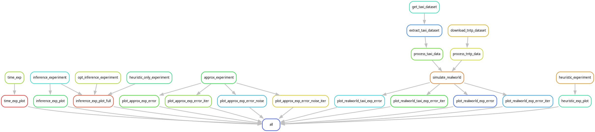

# Representing Edge Flows on Graphs via Sparse Cell Complexes


[](https://arxiv.org/abs/2309.01632)
[](https://github.com/josefhoppe/edge-flow-cell-complexes/blob/main/LICENSE)
[](https://snakemake.readthedocs.io)

## About

This repository accompanies our paper linked above.
The code is split into two repositories:

- This repository contains the evaluation code and snakemake workflow.
- [Cell FLOWer](https://github.com/josefhoppe/cell-flower) is a separate package that contains only the code required for the inference and is published to PyPI.

```
@misc{hoppe2023representing,
      title={Representing Edge Flows on Graphs via Sparse Cell Complexes}, 
      author={Josef Hoppe and Michael T. Schaub},
      year={2023},
      eprint={2309.01632},
      archivePrefix={arXiv},
      primaryClass={cs.SI}
}
```

## Running numerical experiments

This project uses [Snakemake](https://snakemake.readthedocs.io).
To run the experiments:

1. Install [Miniconda](https://docs.conda.io/en/latest/miniconda.html) (or mamba)
2. Create a new conda environment and install dependencies: `conda env update --file workflow/envs/environment.yaml`
3. Run snakemake: `snakemake -c8 all`

## Workflow structure

The Rulegraph gives a rough overview of the structure:



Generally, we aimed to give rules names that are short and easily understood.
For the different kinds of experiments, we used the following naming system:

- **approx_exp** - approximation experiment on synthetic data, i.e., how large is the approximation error?
- **inference_exp** - inference experiment on synthetic data, i.e., how many ground-truth cells have been recovered?
- **realworld_exp** - approximation experiment on realworld-data.
- **time_exp** - experiment to measure runtime performance.
- **heuristic_exp** - experiment to see how many ground-truth cells are detected by the heuristic (first iteration).


## Acknowledgements

Funded by the European Union (ERC, HIGH-HOPeS, 101039827). Views and opinions expressed are however those of the author(s) only and do not necessarily reflect those of the European Union or the European Research Council Executive Agency. Neither the European Union nor the granting authority can be held responsible for them.